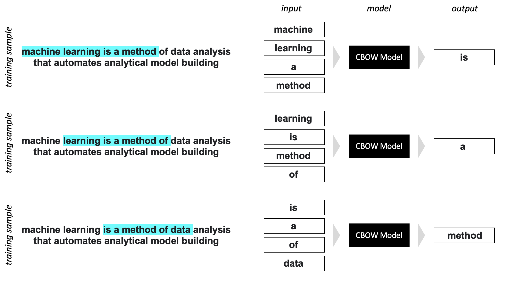
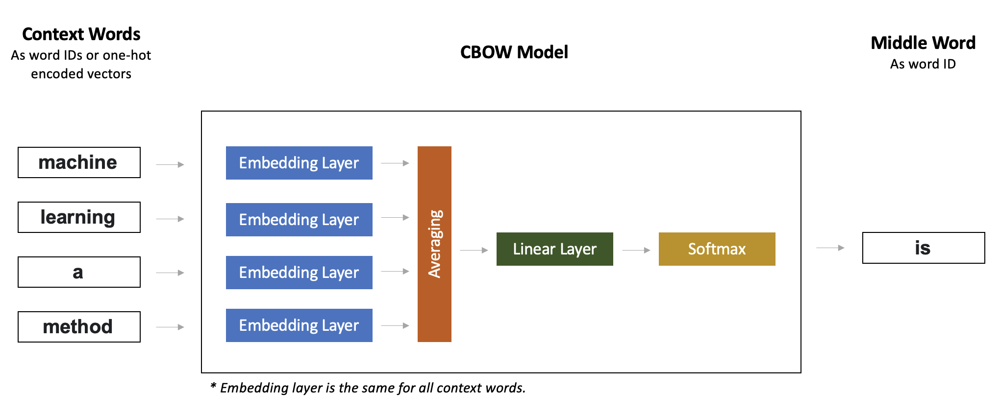
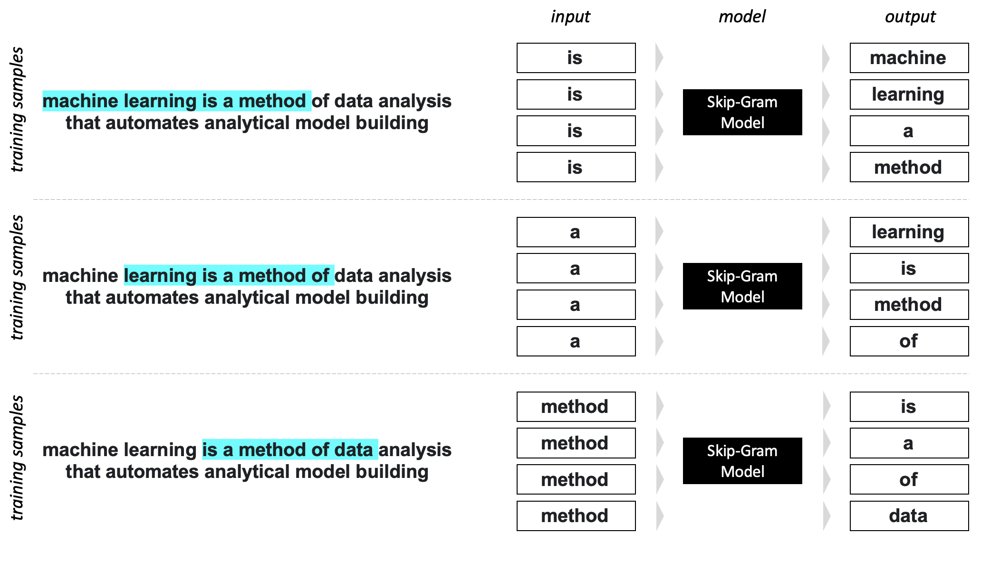
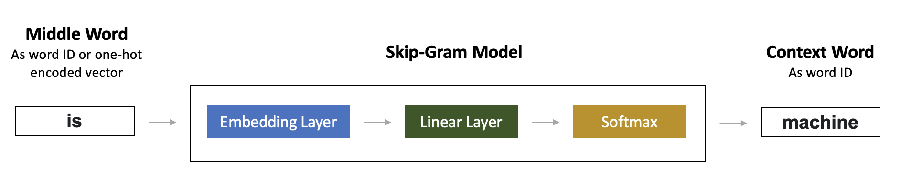

# Word2Vec in PyTorch

Implementation of the first paper on word2vec - [Efficient Estimation of Word Representations in Vector Space](https://arxiv.org/abs/1301.3781). For detailed explanation of the code here, check my post - Word2vec with PyTorch: Reproducing Original Paper.

## Word2Vec Overview

There 2 model architectures desctibed in the paper:

- Continuous Bag-of-Words Model (CBOW), that predicts word based on its context;
- Continuous Skip-gram Model (Skip-Gram), that predicts context for a word.

Difference with the original paper:

- Trained on [WikiText-2](https://pytorch.org/text/stable/datasets.html#wikitext-2) and [WikiText103](https://pytorch.org/text/stable/datasets.html#wikitext103) inxtead of Google News corpus.
- Context for both models is represented as 4 history and 4 future words.
- For CBOW model averaging for context word embeddings used instead of summation.
- For Skip-Gram model all context words are sampled with the same probability. 
- Plain Softmax was used instead of Hierarchical Softmax. No Huffman tree used either.
- Adam optimizer was used instead of Adagrad.
- Trained for 5 epochs.
- Regularization applied: embedding vector norms are restricted to 1.


### CBOW Model in Details
#### High-Level Model

#### Model Architecture



### Skip-Gram Model in Details
#### High-Level Model

#### Model Architecture



## Project Structure


```
.
├── README.md
├── config.yaml
├── notebooks
│   └── Inference.ipynb
├── requirements.txt
├── train.py
├── utils
│   ├── constants.py
│   ├── dataloader.py
│   ├── helper.py
│   ├── model.py
│   └── trainer.py
└── weights
```

- **utils/dataloader.py** - data loader for WikiText-2 and WikiText103 datasets
- **utils/model.py** - model architectures
- **utils/trainer.py** - class for model training and evaluation

- **train.py** - script for training
- **config.yaml** - file with training parameters
- **weights/** - folder where expriments artifacts are stored
- **notebooks/Inference.ipynb** - demo of how embeddings are used

## Usage


```
python3 train.py --config config.yaml
```

Before running the command, change the training parameters in the config.yaml, most important:

- model_name ("skipgram", "cbow")
- dataset ("WikiText2", "WikiText103")
- model_dir (directory to store experiment artifacts, should start with "weights/")


